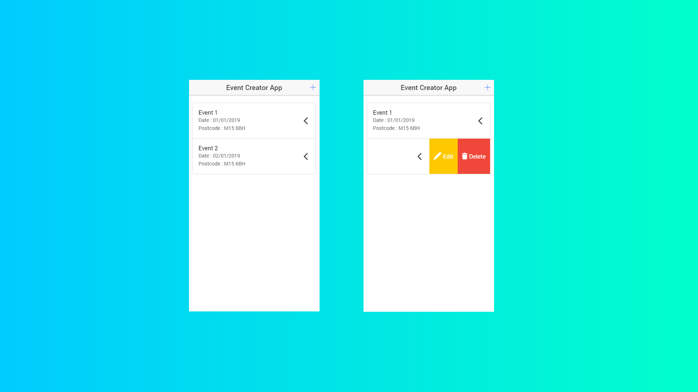
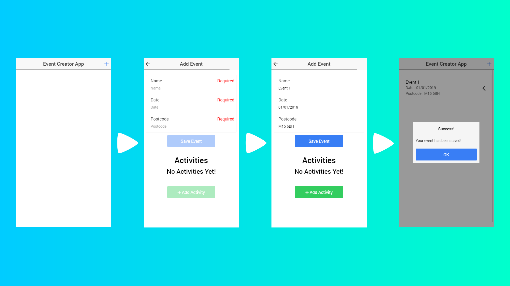
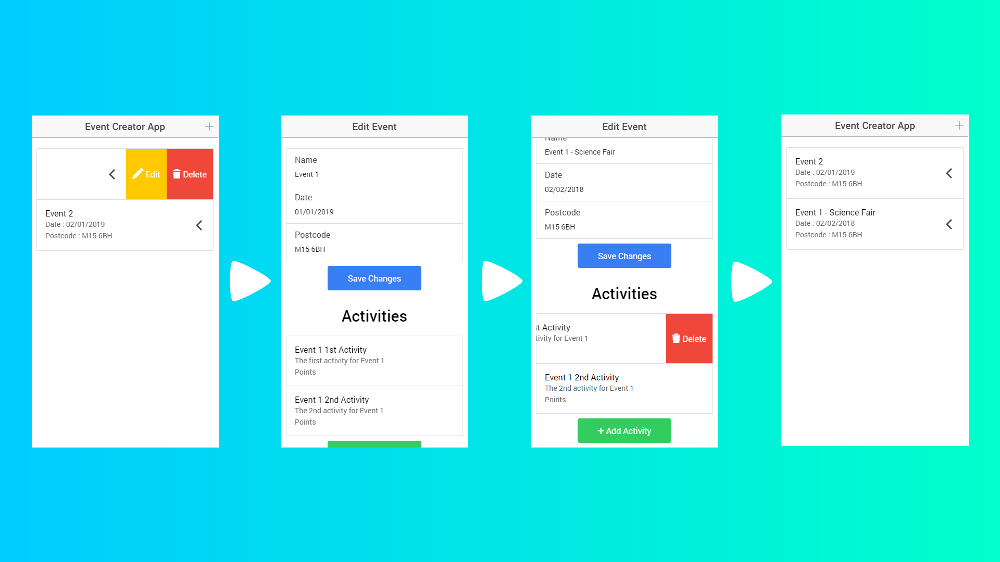

# Event Creator App

Welcome to the Event Creator App repository. Here you can find a more detailed explanation of this app's functionality.

## Event List

The following is an image of the home screen of this app which shows the list of events that are in the database. You can tap the + button in the top right to go to the Add Event screen and swipe each event left to get the options to edit and delete the event.

## Creating Events

You can create events by going to the Add Event screen and filling in the required information. Once you have done that you can save the event which will take you back to the event list, or you can add an activity which will also save the event but it will take you to the **[Activities List](#activities-list)** screen where you can choose an activity from a list of all the activities in the database. The following image shows an event being added but it does not show an activity being added to that event, this is because you can also add an activity to your event from the Edit Event screen which is shown **[here](#editing-events)**.

## Editing Events

You can edit events by swiping to the left on the event that you want to edit in the event list and tapping the Edit option. This will take you to the Edit Event screen which is identical to the Add Event screen. In the edit event screen you can edit the details of your event and save the changes. You can also add activities to your event and delete by swiping to the left on the one that you want to delete and tapping on the delete option.

### Adding Activities

## Deleting Events

## Activities List

## Creating Activities