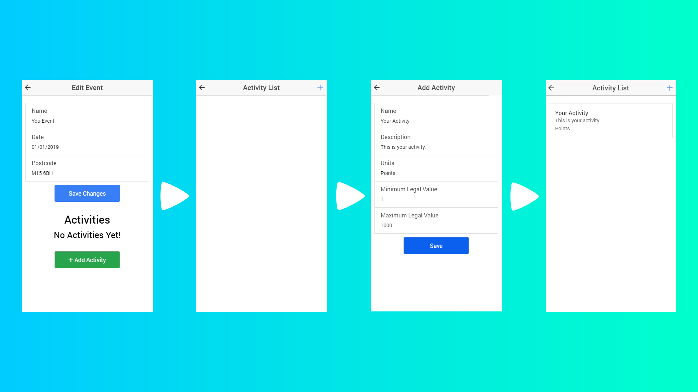

# Event Creator App

Welcome to the Event Creator App repository. Here you can find a more detailed explanation of this app's functionality.

## Event List

The following is an image of the home screen of this app which shows the list of events that are in the database. You can tap the + button in the top right to go to the Add Event screen and swipe each event left to get the options to edit and delete the event.

## Creating Events

You can create events by going to the Add Event screen and filling in the required information. Once you have done that you can save the event which will take you back to the event list, or you can add an activity which will also save the event but it will take you to the **[Activities List](#activities-list)** screen where you can choose an activity from a list of all the activities in the database. The following image shows an event being added but it does not show an activity being added to that event, this is because you can also add an activity to your event from the Edit Event screen which is shown **[here](#editing-events)**.

## Editing Events

You can edit events by swiping to the left on the event that you want to edit in the event list and tapping the Edit option. This will take you to the Edit Event screen which is identical to the Add Event screen. In the edit event screen you can edit the details of your event and save the changes. You can also add activities to your event and delete them by swiping to the left on the one that you want to delete and tapping on the delete option.
>Note : Saving changes will move your event to the bottom of the event list.

### Adding Activities To Your Event

You can add activities to your events from the Add Event screen when you create them and from the Edit Event screen where you edit them. To add them you have to tap the green button that says '+ Add Activity' which will take you to the **[Activities List](#activities-list)**. From there you can **[add an activity](#creating-activities)** to the database or pick from one that is already there by tapping on it.

## Deleting Events

To delete an event you can simply swipe to the left on an the event that you wish to delete and tap the delete option. The same applies to activities linked to your event, however you cannot delete them from the activities list, only the edit screen.

## Activities List

This list can only be accessed by tapping the green button on the screens where you can add events or edit existing ones. It lists all the activities in the database in case there is an activity that you can already use for your event. If there isn't then you can always hit the '+' button in the top right corner of this screen to go to the 'Add Activity' screen as shown **[here](#creating-activities)**.

## Creating Activities

You can create your own activities in the Add Activity screen, which you can access by tapping on the '+' button in the Activities List screen. Once you're there, fill in the required information and save the activity to the database. The app will take you back to the Activities List where you can select your new activity to be added to your event.

